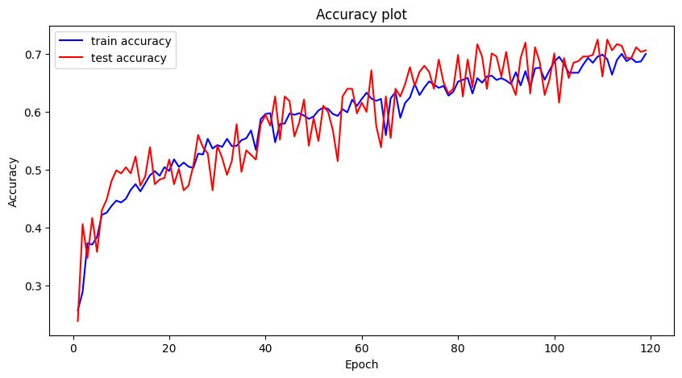

# Classificação de Resíduos com CNN e Data Augmentation

Este repositório apresenta um experimento desenvolvido na disciplina **Fundamentos de Inteligência Artificial (FIA)**, cujo objetivo é utilizar **Redes Neurais Convolucionais (CNNs)** para classificar imagens de resíduos em seis categorias:

`cardboard`, `glass`, `metal`, `paper`, `plastic`, `trash`.

Além do treinamento do modelo, o estudo analisa o **impacto do data augmentation** na capacidade de generalização, avaliando métricas, matriz de confusão e curvas de aprendizado.

---

## 1. Estrutura do Repositório

| Arquivo / Pasta | Descrição |
| --------------- | --------- |
| **Codigo** | Pasta com o notebook com carregamento do dataset, construção do modelo, treinamento e análises e imagens dos resultados. |
| **dataset** | Pasta com o dataset utilizado para a atividade. |
| **README.md** | Documento técnico com contexto, metodologia, resultados e conclusões. |

---

## 2. Contexto e Motivação

A triagem eficiente de resíduos é essencial para melhorar processos de reciclagem e reduzir a contaminação de materiais. Neste projeto, a classificação é tratada como um problema de **visão computacional multiclasse**, integrando conceitos de aprendizado profundo para avaliar como o **data augmentation** influencia o desempenho em um dataset relativamente pequeno e desbalanceado.

---

## 3. Objetivos

- Treinar uma CNN para classificar imagens de resíduos em 6 categorias.
- Avaliar diferentes níveis de data augmentation.
- Analisar desempenho usando:
  - acurácia,
  - matriz de confusão,
  - relatório por classe,
  - curvas de treino e validação.
- Discutir limitações e possíveis melhorias.

---

## 4. Dataset

O dataset utilizado é derivado do **TrashNet**, disponível no Kaggle, contendo seis classes:

`cardboard`, `glass`, `metal`, `paper`, `plastic`, `trash`.

### Características principais:
- Alguns milhares de imagens.
- Desbalanceamento relevante (especialmente para `trash`).
- Imagens RGB redimensionadas para **224×224** pixels.
- Divisão treino/validação via `validation_split` (~85%/15%).

O notebook contém a contagem por classe e exemplos visuais.

---

## 5. Metodologia

### 5.1 Pré-processamento e Data Augmentation

Quatro configurações distintas de *data augmentation* foram avaliadas, variando desde nenhuma transformação até alterações agressivas. Todas utilizaram `rescale=1./255` e `validation_split` fixos. A validação sempre foi realizada **sem nenhum tipo de augmentation**.

---

### 1. Sem Augmentation (baseline)

```python
train_img_generator = ImageDataGenerator(
    rescale=1./255,
    validation_split=validation_split
)
```
### 2. Augmentation Leve

```python
train_img_generator = ImageDataGenerator(
    rescale=1./255,
    validation_split=validation_split,
    horizontal_flip=True,
    zoom_range=0.05,
    rotation_range=5,
    width_shift_range=0.02,
    height_shift_range=0.02
)
```

### 3. Augmentation Moderado

```python
train_img_generator = ImageDataGenerator(
    rescale=1./255,
    validation_split=validation_split,
    horizontal_flip=True,
    vertical_flip=False,
    zoom_range=0.2,
    width_shift_range=0.1,
    height_shift_range=0.1,
    rotation_range=20,
    shear_range=0.1,
    fill_mode='nearest'
)
```

### 4. Augmentation Agressivo

```python
train_img_generator = ImageDataGenerator(
    rescale=1./255,
    validation_split=validation_split,
    horizontal_flip=True,
    vertical_flip=True,
    zoom_range=0.4,
    width_shift_range=0.3,
    height_shift_range=0.3,
    rotation_range=50,
    shear_range=0.3,
    brightness_range=[0.3, 1.5],
    fill_mode='nearest'
)
```

Os resultados apresentados correspondem ao cenário 4 — Augmentation Agressivo — por ter sido a configuração que alcançou o melhor desempenho geral no experimento.

---

### 5.2 Arquitetura da CNN

A arquitetura utilizada segue uma CNN compacta, porém robusta:

- **Entrada:** `224×224×3`
- **Blocos convolucionais:**
  - Conv2D(64) + Dropout(0.2) + MaxPool
  - Conv2D(128) + Dropout(0.2) + MaxPool
  - Conv2D(128) + Dropout(0.4) + MaxPool
- **Classificador:**
  - Flatten
  - Dense(128) + Dropout(0.5)
  - Dense(64)
  - Dense(6, softmax)

### Hiperparâmetros:

- Otimizador: `Adam (lr = 1e-4)`
- Loss: `CategoricalCrossentropy`
- Métrica: `CategoricalAccuracy`

### Callbacks:
- `EarlyStopping(patience=10, restore_best_weights=True)`
- `ModelCheckpoint` para salvar o melhor modelo.

---

### 5.3 Estratégia de Experimentos

- Treinamento em GPU via Google Colab.
- Máximo de 60–100 épocas, com early stopping.
- Avaliação final baseada em:
  - acurácia,
  - matriz de confusão,
  - desempenho por classe,
  - análise das curvas de treino/validação.

---

## 6. Resultados

### 6.1 Acurácia Geral
- **Treino:** ~70%
- **Validação:** ~70.5%
---

### 6.2 Desempenho por Classe (recall aproximado)

| Classe     | Recall |
|-----------|--------|
| paper     | ~21%   |
| metal     | ~21%   |
| cardboard | ~10%   |
| glass     | ~16%   |
| plastic   | ~19%   |
| trash     | ~10%    |

A classe `trash` foi a mais difícil devido ao baixo número de exemplos e alto nível de variação visual.

---

### 6.3 Curvas de Treino e Validação



As curvas indicam:

- Aumento consistente na acurácia ao longo das épocas.
- Menor tendência ao overfitting, porque o modelo foi exposto a variações fortes.
- Validação estabilizada em torno de 70%, mas sem melhora nas métricas por classe.
- Indício de que a rede aprendeu padrões mais gerais, porém pouco específicos para cada categoria.

---

### 6.4 Matriz de Confusão


A matriz mostra:

- Melhores desempenhos relativos para metal e paper.
- Confusões frequentes entre plastic, glass e cardboard.
- Classe trash ainda sendo a mais problemática, com dispersão grande e poucos acertos.

Apesar da acurácia global maior, a matriz deixa claro que o modelo não aprendeu bem as classes individualmente.

---

## 7. Impacto do Data Augmentation

Foram analisadas quatro configurações, mas aqui destacamos a comparação mais relevante:

### **1. Sem augmentation**
- Acurácia de teste: ~57%
- Overfitting elevado
- Generalização fraca

### **2. Augmentation leve/moderado**
-	Acurácia entre 60–65%
-	Melhor equilíbrio entre treino e validação
-	Métricas por classe ainda modestas, mas mais estáveis

### **3. Augmentation agressivo (atual)**
- Acurácia de teste: ~70.5% (melhor resultado global)
- Loss mais baixo
- Porém, precisão e recall por classe continuam muito baixos
- Modelo acerta “no geral”, mas erra muito dentro de cada categoria específica
- Forte indício de que o augmentation exagerado cria variações irreais, confundindo padrões importantes

**Conclusão:**  
O augmentation agressivo elevou a acurácia total, mas não melhorou a capacidade do modelo em distinguir as classes individualmente. No contexto desse dataset, a configuração agressiva gera diversidade suficiente para aumentar a acurácia global, mas ao custo de piorar a precisão por classe. Assim, o augmentation moderado continua sendo o mais balanceado para generalização real.

---

## 8. Limitações

- Dataset pequeno e desbalanceado, o que prejudica o aprendizado de classes menos representadas.
- Similaridade visual alta entre algumas categorias, como plastic, glass e cardboard, levando a confusões frequentes mesmo com augmentation.
- Uso de uma arquitetura relativamente simples, que limita a capacidade do modelo de extrair padrões mais profundos — especialmente perceptível nas métricas por classe.
- Classe trash com poucos exemplos e grande variabilidade interna, resultando em baixo recall mesmo nas melhores configurações.
- Augmentation agressivo aumenta a acurácia geral, mas não resolve a baixa precisão e recall das categorias, já que parte das transformações pode distorcer demais os padrões reais das imagens.
- Ausência de técnicas adicionais de regularização (como class weighting ou focal loss), que poderiam ajudar no desbalanceamento entre classes.

---

## 9. Tecnologias Utilizadas

- Python  
- TensorFlow / Keras  
- NumPy, Pandas  
- Matplotlib, Seaborn  
- Jupyter Notebook  
- Google Colab (GPU)

---

## 10. Integrantes


---
